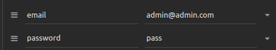
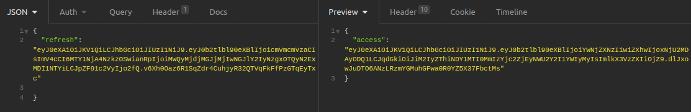
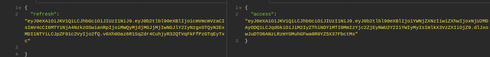
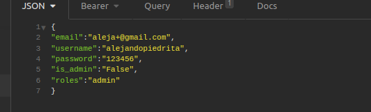
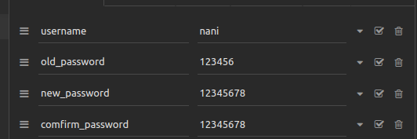
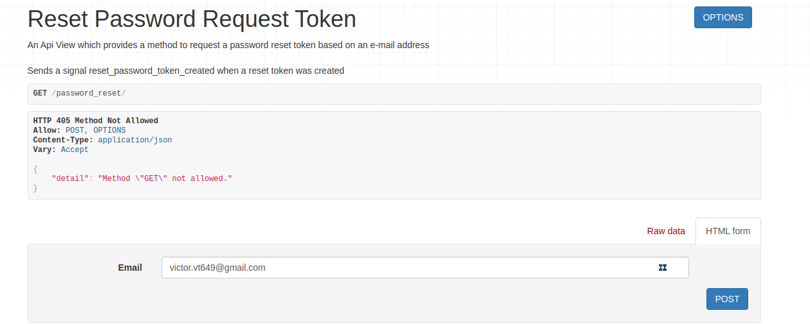
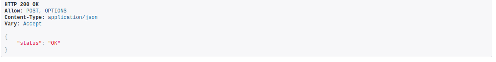
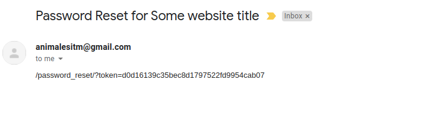
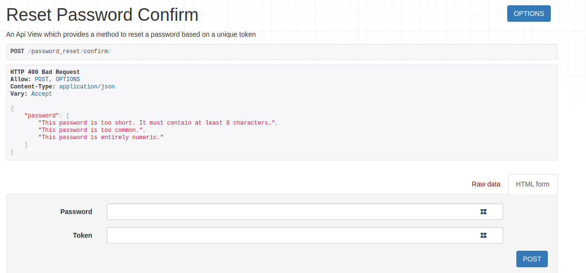
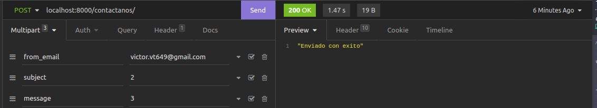

Como consumir la API De django
---
***

> GitHub [@MyGitHub](https://github.com/beowoulfk)

## Introdución

Esta guia tiene como objeto dar una explicación general de como usar correctamente esta api
en especial de como consumir los endopoints aqui propuestos

## login (http://localhost:8000/login/)
Este es el primer enpoint que se debe de usar, ya que a raiz de esta petición se derivan las demas
esta petición contiene 2 caracterisitcas importantes, estas son:

por defecto el primer usuario existente es el admin@admin.com, una vez hecha la petición, obtendremos esta respuesta.

En el Json es importante tener en cuenta 2 de los parametros estos son:
 
### **refresh**
Este es el token de refesco es decir, que con el podrás generar nuevos token de acceso antes de que expire el 
primer token de acceso generado durante el primer login.

El token de refresco tiene una duración de 24 horas, cuando finalice este tiempo no podrás
hacer mas refrescos con este token y necesitarás logearte de nuevo.
 
 Para realizar el refresco del token debes de hacer uso de este endopint (http://localhost:8000/token/refresh/)
 y debes de pasarle como parametro el token de refresco para que te genere un nuevo token de acceso.

### **access**
Este token de acceso se usa Como una capa de seguridad para el manejo de roles y usuarios, por lo cual es necesario
pasarlo como un parametro en los request, este tiene una duración de 20 minutos.

Solo algunos endpoints no lo exigen, sin embargo sin este token no podrás hacer peticiones.

## Register user (http://localhost:8000/register/)
Como inicialmente  solo existe un usuario, es necesario crear diferentes usuarios, al menos uno por cada rol
los roles usados en la API son (Admin, colaborador de registros, coloraborador de etiquetado y usuario) es
importante registralos con emails validos y nombres completamente diferentes, ya que en un futuro cuando se desee 
reestablecer la contraseña seŕa necesario enviar un email al usuario.

En el endpoint register son campos obligatorios **email** , **password** y **username** , tanto email como username
deben de ser unicos.

El parametro is_admin no es obligatorio ya que por defecto es False, por lo cual se puede ignorar
Recuerda que es Muy importante que el username y el email sean unicos.

En caso de exito, obtendŕas una respuesta que dice usuario creado de forma exitosa.

## change password (http://localhost:8000/change-password)

Change password tiene como finalidad **cambiar** la contraseña del usuario apartir de 
la contraseña vieja, es decir debes de conocer tu antigua contraseña para cambiarla de lo contrario,
si olvidaste tu contraseña necesitas reestablecerla.

Esta vista recibe como parametros:

Donde todos son obligatorios, debe de tener en cuenta que para acceder a esta vista necesita
estar autenticado.

Esta vista es de tipo PUT, no admite ninguna otra petición.

## reset password (http://localhost:8000/password_reset/)

En caso de no recordar tu contraseña, este endpoint te permitirá cambiar tu contraseña, para ell
debes de ingresar el email con el que te registraste, es importante que sea un Email valido y que exista en la db
de lo contrario no podrás restablecer tu contraseña.

La petición es de tipo post y no necesitas usar autenticación por token.

Si el email ha sido valido te enviará un response **"status: ok"**

El paso siguente es ir al email que envió el cliente, 

Lo unico que le interesa a la persona es ingresar el token, es decir lo que está despues del **token=**

###  reset password confirm  (http://localhost:8000/password_reset/confirm/)
Luego de que tengas el token copiando es necesario tener este endpoint abierto para pegar el token 
y la nueva contraseña

allí debes de ingresar la nueva contraseña y el token que previamente obtuviste.

## contact us (http://localhost:8000/contactanos/)
Este endpoint es el encargado de enviar un correo electronico a los administradores 
ya sea para pedir una cuenta de usuario o resolver dudas.
La petición es de tipo post y debe de contener el email del quién lo envia, la razón y el mensaje.

